# TP13 — Évaluation Docker

> **Auteur :** Eliot Giraud
> **Cours :** Docker — M1 MDS
> **Dépôt GitHub :** [EliotGIRAUD/tp13-docker-evaluation](https://github.com/EliotGIRAUD/tp13-docker-evaluation)
> **VPS de déploiement :** [vps120699.serveur-vps.net](http://vps120699.serveur-vps.net) (`185.98.137.102`)
> **Image publiée :** `ghcr.io/eliotgiraud/mon-api:latest` (via la CI GitHub Actions)

Ce dépôt contient l'intégralité de l'évaluation Docker : une API Node.js conteneurisée, sa stack `docker compose` complète (load-balancer Nginx, deux instances de l'API, registry privé, observabilité Prometheus / Grafana / cAdvisor / node-exporter, Portainer) et un pipeline CI/CD GitHub Actions.

| Service | URL publique |
|---|---|
| API (load-balancée) | http://185.98.137.102/ |
| API cat | http://185.98.137.102/cat |
| API dog | http://185.98.137.102/dog |
| Grafana | http://185.98.137.102/grafana/ (admin / admin74) |
| Prometheus | http://185.98.137.102/prometheus/ |
| Portainer | http://185.98.137.102:8083/ |
| Registry UI | http://185.98.137.102:8080/ |

## Sommaire

- [Arborescence du dépôt](#arborescence-du-dépôt)
- [Démarrage rapide](#démarrage-rapide)
- [Partie 1 — API & Dockerfile](#partie-1--api--dockerfile)
- [Partie 2 — Registry privé](#partie-2--registry-privé)
- [Partie 3 — Stack Compose & Nginx](#partie-3--stack-compose--nginx)
- [Partie 4 — Sécurité](#partie-4--sécurité)
- [Partie 5 — Validation de la stack](#partie-5--validation-de-la-stack)
- [Partie 6 — Questions théoriques](#partie-6--questions-théoriques)
- [Partie 7 — Observabilité & Production](#partie-7--observabilité--production)
- [Partie 8 — Volumes](#partie-8--volumes)
- [Partie 9 — CI/CD GitHub Actions](#partie-9--cicd-github-actions)
- [Partie 10 — Déploiement VPS](#partie-10--déploiement-vps)

---

## Arborescence du dépôt

```text
tp13/
├── .github/
│   └── workflows/
│       └── docker.yml             # Pipeline CI/CD (build + Trivy + push ghcr.io)
├── api/                           # Code Node.js + Dockerfile durci
│   ├── app.js
│   ├── package.json
│   ├── Dockerfile
│   └── .dockerignore
├── nginx/
│   ├── nginx.conf                 # Conf globale (worker_processes=1 pour RR déterministe)
│   └── default.conf               # Upstreams round-robin + locations /cat /dog /grafana /prometheus /portainer
├── monitoring/
│   ├── prometheus.yml             # Scrap config (cat, dog, node-exporter, cAdvisor, prom)
│   └── grafana/
│       ├── provisioning/
│       │   ├── datasources/datasource.yml
│       │   └── dashboards/dashboards.yml
│       └── dashboards/
│           └── tp13-overview.json # Dashboard provisionné automatiquement
├── scripts/
│   └── deploy-vps.sh              # Script de déploiement clé-en-main sur le VPS
├── captures/                      # Captures d'écran demandées
├── docker-compose.yml             # Stack principale (cat, dog, nginx, monitoring)
├── docker-compose.registry.yml    # Stack indépendante : registry + UI Joxit
├── docker-compose.prod.yml        # Override prod : limites CPU/RAM
├── .env / .env.example            # Variables d'environnement (port, PET, etc.)
└── README.md
```

---

## Démarrage rapide

```bash
# 1. Lancer le registry privé (stack indépendante)
docker compose -f docker-compose.registry.yml --env-file .env up -d

# 2. Build de l'image API et push vers le registry privé
docker build -t mon-api:1.0.0 ./api
docker tag  mon-api:1.0.0 185.98.137.102:5000/mon-api:1.0.0
docker push 185.98.137.102:5000/mon-api:1.0.0

# 3. Démarrer la stack principale (override prod avec limites CPU/RAM)
docker compose -f docker-compose.yml -f docker-compose.prod.yml --env-file .env up -d
```

Sur le VPS, tout est automatisé par `scripts/deploy-vps.sh` (voir [Partie 10](#partie-10--déploiement-vps)).

---

## Partie 1 — API & Dockerfile

### Code de l'API

L'API se trouve dans [`api/app.js`](api/app.js) et expose **trois** routes :

| Route | Description |
|---|---|
| `GET /` | Retourne en JSON `{ hostname, pet, counter }` (compteur basé sur `prom-client`) |
| `GET /healthz` | Retourne `200 { "status": "ok" }` — utilisée par le `HEALTHCHECK` |
| `GET /metrics` | Métriques Prometheus (compteur de requêtes + métriques système) |

Le compteur est implémenté avec la librairie [`prom-client`](https://github.com/siimon/prom-client) :

```javascript
const rootRequestsCounter = new client.Counter({
  name: 'root_requests_total',
  help: 'Nombre total de requêtes reçues sur GET /',
});
```

À chaque appel sur `/`, le compteur est incrémenté et sa valeur courante est renvoyée dans la réponse JSON.

### Dockerfile

Le [`api/Dockerfile`](api/Dockerfile) respecte toutes les contraintes :

- ✅ Image de base **`node:20-alpine`** (image légère et durcie)
- ✅ Utilisateur **non-root** (`USER node`)
- ✅ `npm install --only=production` (pas de dépendances de dev)
- ✅ `.dockerignore` qui exclut `node_modules`, `.env`, `.git`
- ✅ `COPY package*.json` **en premier**, puis `COPY . .` → cache Docker optimal
- ✅ **HEALTHCHECK** ciblant `/healthz` :

```dockerfile
HEALTHCHECK --interval=15s --timeout=3s --start-period=10s --retries=3 \
  CMD wget --spider --quiet http://localhost:3000/healthz || exit 1
```

| Paramètre | Valeur | Justification |
|---|---|---|
| `interval` | 15 s | Bon compromis réactivité / charge |
| `timeout` | 3 s | `/healthz` doit répondre quasi-instantanément |
| `start-period` | 10 s | Laisse à Node le temps de démarrer avant de pénaliser |
| `retries` | 3 | Tolère un échec ponctuel avant marquage `unhealthy` |

---

## Partie 2 — Registry privé

Le registry est défini dans [`docker-compose.registry.yml`](docker-compose.registry.yml) et **lancé séparément** de la stack principale :

```bash
docker compose -f docker-compose.registry.yml --env-file .env up -d
```

Il déploie :

- `registry:2` exposé sur le port `5000`
- `joxit/docker-registry-ui` exposé sur le port `8080`

L'image API est ensuite poussée vers ce registry :

```bash
docker build -t mon-api:1.0.0 ./api
docker tag  mon-api:1.0.0 185.98.137.102:5000/mon-api:1.0.0
docker push 185.98.137.102:5000/mon-api:1.0.0
```

Dans [`docker-compose.yml`](docker-compose.yml), le champ `image:` des services `cat` et `dog` pointe bien vers le registry privé :

```yaml
image: ${REGISTRY_HOST}:${REGISTRY_PORT}/${API_IMAGE_NAME}:${API_IMAGE_TAG}
# soit, résolu : 185.98.137.102:5000/mon-api:1.0.0
```

**Capture de l'interface web** (http://185.98.137.102:8080) :

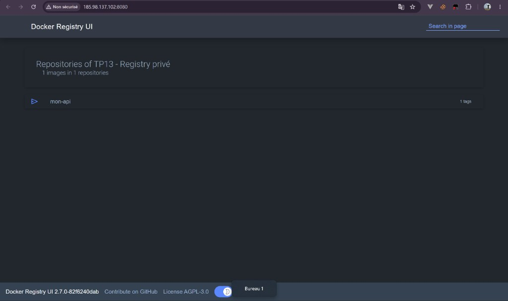

---

## Partie 3 — Stack Compose & Nginx

### docker-compose.yml

[`docker-compose.yml`](docker-compose.yml) orchestre les services sur le réseau personnalisé `tp13_app_net` :

- `cat` : API avec `PET=cat`, **aucun port exposé**
- `dog` : API avec `PET=dog`, **aucun port exposé**
- `nginx` : reverse-proxy exposant le port `${NGINX_PORT}` (80)

Les healthchecks sont déclarés sur `cat` et `dog`, et `nginx` les attend :

```yaml
depends_on:
  cat:
    condition: service_healthy
  dog:
    condition: service_healthy
```

### Configuration Nginx

[`nginx/default.conf`](nginx/default.conf) définit des upstreams dédiés et délègue le routage :

```nginx
upstream api_pool {       # round-robin pour GET /
    server cat:3000;
    server dog:3000;
}
upstream cat_only      { server cat:3000;        }
upstream dog_only      { server dog:3000;        }
upstream grafana_up    { server grafana:3000;    }
upstream prometheus_up { server prometheus:9090; }

server {
    listen 80;
    location = /cat       { proxy_pass http://cat_only/;   }
    location = /dog       { proxy_pass http://dog_only/;   }
    location /grafana/    { proxy_pass http://grafana_up;    }   # WebSocket headers en plus
    location /prometheus/ { proxy_pass http://prometheus_up; }
    location /            { proxy_pass http://api_pool;      }   # round-robin par défaut
}
```

L'algorithme **round-robin** est l'algorithme par défaut de Nginx → chaque requête sur `/` est servie alternativement par `cat` puis `dog`.

> 💡 **Détail important** : [`nginx/nginx.conf`](nginx/nginx.conf) force `worker_processes 1;`. Avec plusieurs workers Nginx, chacun maintient son **propre** état d'upstream et démarre par le premier serveur (cat) — ce qui peut casser l'alternance attendue lors d'un test rapide. Un worker unique garantit un round-robin déterministe.

---

## Partie 4 — Sécurité

### Toutes les valeurs configurables passent par `.env`

Le fichier [`.env.example`](.env.example) liste toutes les variables :

```dotenv
API_PORT=3000
API_IMAGE_NAME=mon-api
API_IMAGE_TAG=1.0.0
REGISTRY_HOST=185.98.137.102
REGISTRY_PORT=5000
REGISTRY_UI_PORT=8080
CAT_PET=cat
DOG_PET=dog
NGINX_PORT=80
PORTAINER_PORT=8083
GRAFANA_ADMIN_USER=admin
GRAFANA_ADMIN_PASSWORD=admin74
```

Aucune valeur n'apparaît en dur dans `docker-compose.yml` (hors valeurs par défaut techniques comme le port 3000 interne du conteneur).

Le `.env` réel **n'est pas versionné** (cf. `.gitignore`), seul `.env.example` est commit.

### Scan Trivy & choix de l'image de base

```bash
trivy image 185.98.137.102:5000/mon-api:1.0.0 \
  --severity HIGH,CRITICAL --ignore-unfixed
```

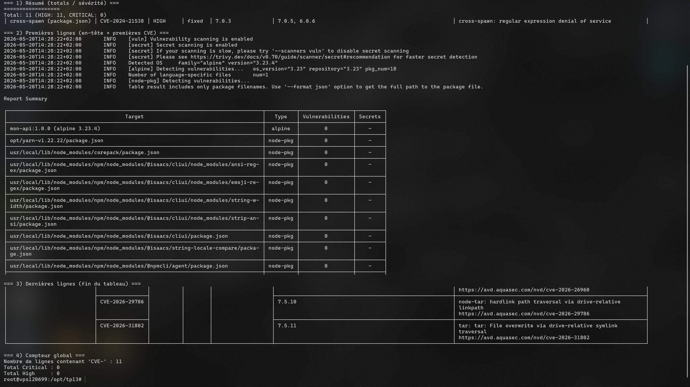

**Résultat de notre scan sur `mon-api:1.0.0` (HIGH + CRITICAL, fixables uniquement) :**

```text
Report Summary
mon-api:1.0.0 (alpine 3.23.4)  →  0 vulnerabilités OS
opt/yarn-v1.22.22              →  0
usr/local/.../npm subdeps      →  11 HIGH (cross-spawn, glob, minimatch, tar)

Total: 11 (HIGH: 11, CRITICAL: 0)
```

**Justification du choix `node:20-alpine` plutôt que `node:latest` :**

| Image | Taille | Distribution | CVE typiques (HIGH+CRITICAL) |
|---|---|---|---|
| `node:latest` | ~1.1 Go | Debian (bookworm) — glibc, openssl, perl, bash, coreutils… | Plusieurs dizaines (50+) |
| `node:20-alpine` | ~140 Mo | Alpine Linux 3.23 + musl libc + busybox | **0 sur l'OS** dans notre scan |

Points clés à retenir :

- **0 CVE sur l'OS Alpine 3.23.4** dans notre image : c'est la vraie victoire d'`alpine`. Avec `node:latest` (Debian), Trivy remonterait des CVE openssl, glibc, perl, bash, etc., même sans avoir installé quoi que ce soit.
- Les **11 CVE HIGH restantes** sont toutes dans des dépendances transitives de `npm` lui-même (`cross-spawn`, `glob`, `minimatch`, `tar`) qui sont embarquées avec Node mais **ne sont pas utilisées au runtime** par notre app. Elles ne sont pas exposées à du contenu utilisateur ni au réseau.
- **0 CVE CRITICAL** → la pipeline CI (Partie 9) passe avec `exit-code: 1` sur `severity: CRITICAL`.
- Image quasi 8× plus petite → builds CI plus rapides, pulls VPS plus rapides, surface d'attaque drastiquement réduite.

### Dockerfile : cache et `.dockerignore`

```dockerfile
COPY package*.json ./           # ← d'abord les manifestes
RUN npm install --only=production
COPY . .                        # ← puis le code applicatif
```

Tant que les dépendances ne changent pas, la couche `npm install` reste cachée → builds **très rapides**.

Le [`.dockerignore`](api/.dockerignore) garantit que `node_modules`, `.env` et `.git` n'entrent jamais dans le contexte de build.

---

## Partie 5 — Validation de la stack

### 5.1 — `docker compose ps` : tous les services Up (healthy)

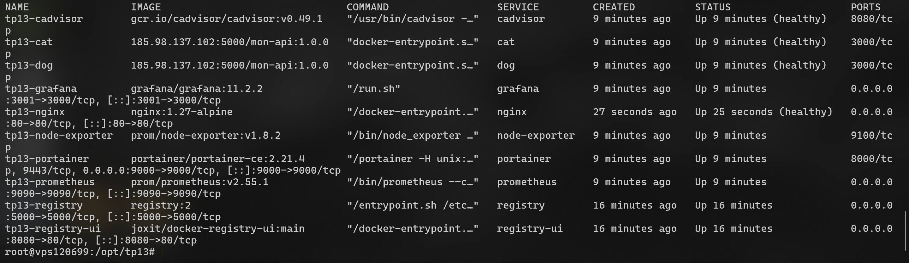

### 5.2 — Load balancing visible sur `/`

Deux appels successifs sur `http://vps120699.serveur-vps.net/` :

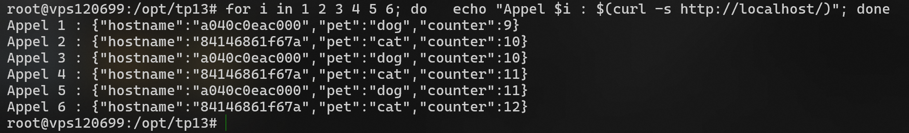

Les hostnames alternent bien entre `cat` et `dog` (round-robin).

### 5.3 — `/cat` → PET cat, `/dog` → PET dog avec compteurs distincts

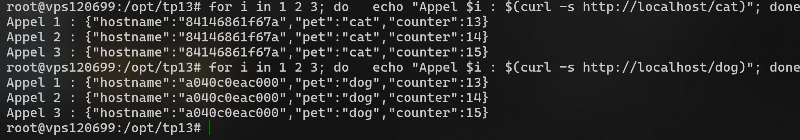

Chaque conteneur maintient son **propre** compteur (en mémoire) → les valeurs diffèrent entre les deux services.

---

## Partie 6 — Questions théoriques

### Question 1 — Swarm

**Différence `docker compose up` vs `docker stack deploy` :**

- `docker compose up` est conçu pour un **environnement de développement local** sur **un seul hôte Docker**. Il lit `docker-compose.yml`, build éventuellement les images localement (`build:`) puis lance les conteneurs. Pas de notion de cluster, pas de replicas distribués.

- `docker stack deploy` cible **un cluster Docker Swarm** (plusieurs nodes). Il s'appuie sur un fichier au format Compose mais déploie des **services Swarm** (avec replicas, placement, rolling updates, secrets natifs, etc.) sur tous les nodes du cluster.

**Pourquoi `build:` ne marche pas en Swarm ?**

Un cluster Swarm dispose de plusieurs nodes. Si Swarm acceptait `build:`, il faudrait builder l'image **sur chaque node** (chaque node ayant ses propres caches, dépendances, etc.), ce qui produirait potentiellement des images **différentes**. C'est incompatible avec la garantie d'idempotence d'un déploiement.

→ La bonne pratique est de **builder l'image en amont**, la **pousser dans un registry** accessible depuis tous les nodes, puis de référencer son URL via `image:` dans la stack. C'est exactement ce qu'on fait dans ce TP avec le registry privé.

### Question 2 — Secrets

**Variable d'environnement vs Docker Secret :**

| Critère | Variable d'environnement | Docker Secret |
|---|---|---|
| Visibilité | `docker inspect`, `ps -e`, dans les logs si imprimé | Aucune fuite via `docker inspect` |
| Stockage | En clair dans le manifeste Compose | Chiffré au repos dans le raft Swarm |
| Rotation | Recréer le conteneur | `docker secret create` + update du service |
| Diffusion | Pour tous (héritage env) | Uniquement aux services qui le déclarent |
| Cible | Dev local | Production / Swarm |

**Emplacement du secret dans le conteneur :** Docker monte chaque secret en tant que **fichier en lecture seule** dans `/run/secrets/<nom_du_secret>` (tmpfs en mémoire, donc jamais sur disque).

**Lecture depuis Node.js :**

```javascript
const fs = require('node:fs');
const dbPassword = fs.readFileSync('/run/secrets/db_password', 'utf8').trim();
```

Le `.trim()` est important pour retirer un éventuel `\n` final.

### Question 3 — Backup

En production, voici les éléments à sauvegarder et leur criticité :

**Recréable automatiquement (pas besoin de sauvegarder) :**

- **Images Docker** : tag git → CI/CD reconstruit
- **Conteneurs en eux-mêmes** : `docker compose up -d` les recrée
- **Réseaux Docker** : recréés par Compose
- **Code applicatif** : versionné dans Git (origine de vérité)

**Irremplaçable (à sauvegarder impérativement) :**

- **Volumes nommés contenant des données métier** : bases de données (PostgreSQL, MySQL), fichiers utilisateurs uploadés, etc.
- **Configurations sensibles non versionnées** : `.env`, certificats TLS / Let's Encrypt, clés SSH/JWT, secrets divers
- **Données du registry privé** si on en exploite un (sauf si les images sont également présentes ailleurs : ghcr.io, Docker Hub)
- **Données de Grafana** (dashboards modifiés à la main, alertes, users) → c'est pour ça qu'on s'efforce ici de tout **provisionner** par fichier, justement pour éliminer cette dépendance.
- **Logs critiques** s'ils ne sont pas exportés vers une solution centralisée

**Stratégie typique :** snapshot quotidien des volumes critiques (ex: `docker run --rm -v <vol>:/data -v $(pwd):/backup alpine tar czf /backup/<vol>.tgz /data`) + sauvegarde déportée (S3, autre datacenter). Tester la procédure de restauration régulièrement !

---

## Partie 7 — Observabilité & Production

La stack [`docker-compose.yml`](docker-compose.yml) inclut un **stack d'observabilité complète** :

| Service | Image | Rôle | Accès public |
|---|---|---|---|
| `prometheus` | `prom/prometheus:v2.55.1` | Scrape les métriques (`cat`, `dog`, `cadvisor`, `node-exporter`, lui-même) | via Nginx → `/prometheus/` |
| `node-exporter` | `prom/node-exporter:v1.8.2` | Métriques système (hôte) | interne uniquement |
| `cadvisor` | `gcr.io/cadvisor/cadvisor:v0.49.1` | Métriques par conteneur Docker | interne uniquement |
| `grafana` | `grafana/grafana:11.2.2` | Dashboards | via Nginx → `/grafana/` |
| `portainer` | `portainer/portainer-ce:2.21.4` | Gestion graphique des conteneurs | port 8083 direct |

### Provisioning Grafana

Tout est **provisionné automatiquement** au démarrage :

- Datasource Prometheus : [`monitoring/grafana/provisioning/datasources/datasource.yml`](monitoring/grafana/provisioning/datasources/datasource.yml)
- Dashboard "TP13 - Vue d'ensemble" : [`monitoring/grafana/dashboards/tp13-overview.json`](monitoring/grafana/dashboards/tp13-overview.json)

Le dashboard contient :

- Requêtes/sec (total et par service)
- Total des requêtes par service (compteur depuis le démarrage)
- Requêtes par seconde — cat vs dog (séries temporelles)
- CPU + RAM par conteneur (cAdvisor)
- CPU + RAM hôte (node-exporter)

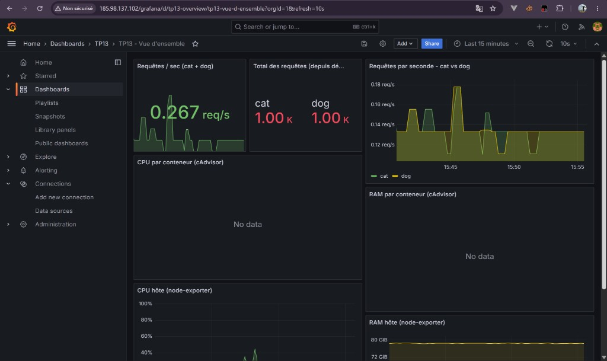

Et les cibles scrapées par Prometheus, toutes en `UP` :

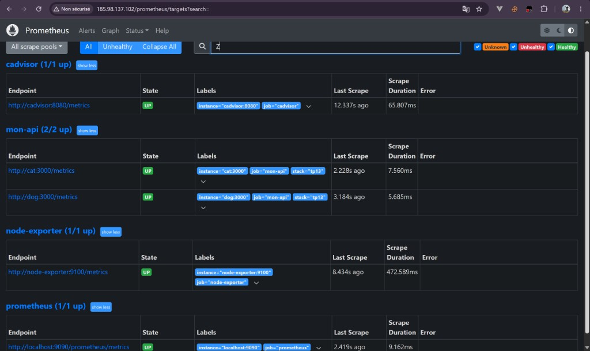

### Limites CPU/RAM en production

[`docker-compose.prod.yml`](docker-compose.prod.yml) ajoute des limites à chaque service :

```yaml
cat:
  deploy:
    resources:
      limits:
        cpus: "0.50"
        memory: "256M"
      reservations:
        cpus: "0.10"
        memory: "64M"
```

Lancement :

```bash
docker compose -f docker-compose.yml -f docker-compose.prod.yml --env-file .env up -d
```

---

## Partie 8 — Volumes

### Volumes nommés vs bind mounts

| Type | Utilisation dans la stack | Pourquoi |
|---|---|---|
| **Volumes nommés** | `prometheus_data`, `grafana_data`, `portainer_data`, `registry_data` | Données qui doivent **persister entre redémarrages**. Gérés par Docker, portables, facile à backup |
| **Bind mounts** | `nginx/default.conf`, `monitoring/prometheus.yml`, `monitoring/grafana/provisioning/`, `monitoring/grafana/dashboards/` | Fichiers de **configuration versionnés** : on veut que la modification d'un fichier local se reflète immédiatement dans le conteneur (après redémarrage) |

### Captures

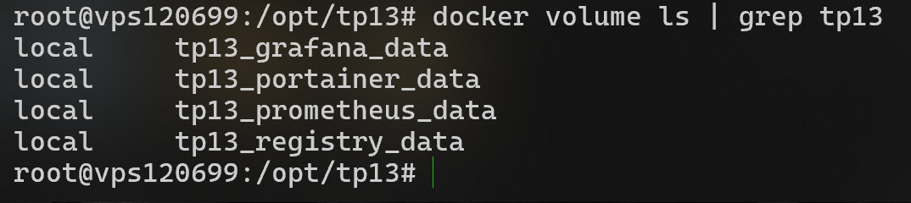
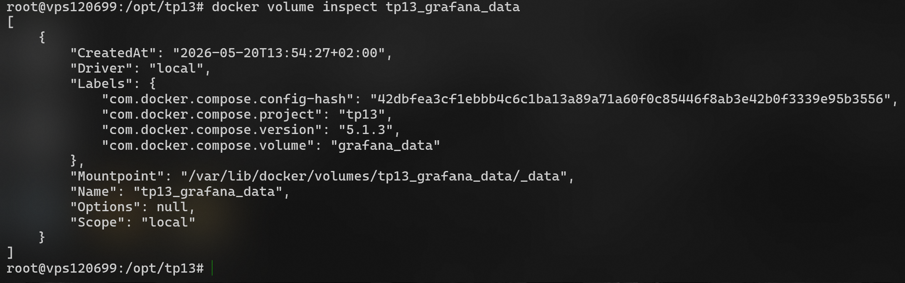

### Justification

- Les **données utilisateurs** (Grafana, Portainer, registry, séries temporelles Prometheus) doivent survivre à `docker compose down`. Un volume nommé garantit cette persistance et reste géré par Docker (on peut le lister, l'inspecter, le sauvegarder).
- Les **fichiers de configuration** sont versionnés dans Git → on monte directement le fichier source en bind mount, sans copier dans une image custom. Modification du fichier → `docker compose restart <service>` et c'est pris en compte.

---

## Partie 9 — CI/CD GitHub Actions

[`.github/workflows/docker.yml`](.github/workflows/docker.yml) automatise :

1. **Trigger** : sur chaque push sur `main` (+ `workflow_dispatch` pour relance manuelle)
2. **Build** de l'image Docker (`docker/build-push-action`)
3. **Scan Trivy** avec `exit-code: 1` sur **CVE CRITICAL** → le pipeline échoue si une CVE critique est détectée
4. **Push** vers `ghcr.io/<user>/mon-api:git-<sha-court>` + `:latest`

Le tag SHA court est calculé dans une étape `meta` :

```yaml
SHORT_SHA=$(git rev-parse --short HEAD)
echo "image_ref=${REGISTRY}/${OWNER}/${IMAGE_NAME}:git-${SHORT_SHA}" >> "$GITHUB_OUTPUT"
```

Aucun secret supplémentaire n'est nécessaire : on utilise `GITHUB_TOKEN` (fourni par défaut) pour pousser sur ghcr.io.

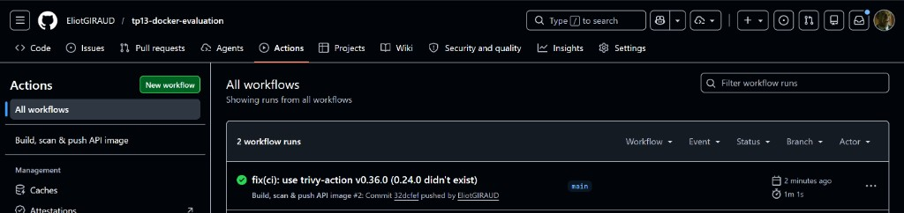

---

## Partie 10 — Déploiement VPS

**URL publique :** [http://vps120699.serveur-vps.net](http://vps120699.serveur-vps.net)
**IP :** `185.98.137.102`

### Points d'entrée déployés

| Service | URL |
|---|---|
| API (load-balancée) | http://vps120699.serveur-vps.net/ |
| API cat | http://vps120699.serveur-vps.net/cat |
| API dog | http://vps120699.serveur-vps.net/dog |
| Grafana | http://vps120699.serveur-vps.net/grafana/ — `admin` / `admin74` |
| Prometheus | http://vps120699.serveur-vps.net/prometheus/ |
| Portainer | http://vps120699.serveur-vps.net:8083/ |
| Registry UI | http://vps120699.serveur-vps.net:8080/ |

> 📝 **Choix d'architecture — tout passe par Nginx** : l'hébergeur OVH du VPS filtre un grand nombre de ports HTTP non standards au niveau de son réseau (5000, 9000, 9090, 8082, 8084, 12011…). Plutôt que de chercher un port libre pour chaque service, on expose tout via le **reverse proxy Nginx** déjà déployé (port 80). Avantage : une seule URL/IP à publier, et le routage propre est géré par Nginx (`/grafana/` → service Grafana, `/prometheus/` → service Prometheus, etc.). Les services backend ne sont **jamais exposés directement sur l'hôte** — ils écoutent uniquement sur le réseau Docker interne `app_net`.

### Procédure de déploiement

Le script [`scripts/deploy-vps.sh`](scripts/deploy-vps.sh) automatise tout :

```bash
# Depuis le poste local : copier les fichiers sur le VPS
scp -r ./ root@185.98.137.102:/opt/tp13/

# Puis se connecter et lancer le script
ssh root@185.98.137.102
cd /opt/tp13
bash scripts/deploy-vps.sh
```

Le script :

1. Installe Docker si nécessaire
2. Configure `/etc/docker/daemon.json` pour autoriser le registry HTTP (`insecure-registries`)
3. Lance la stack registry
4. Build et push l'image API vers le registry privé
5. Lance la stack principale avec l'override prod
6. Vérifie l'état des services

### Captures depuis le VPS


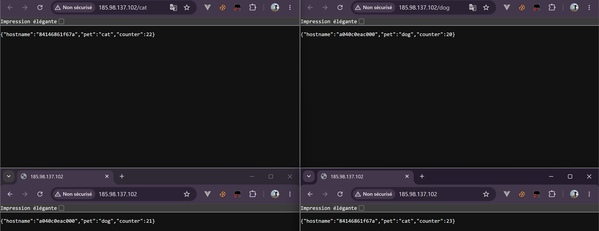
